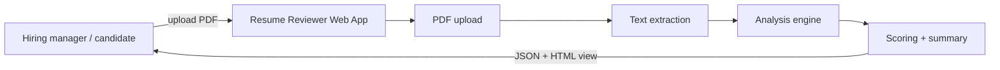
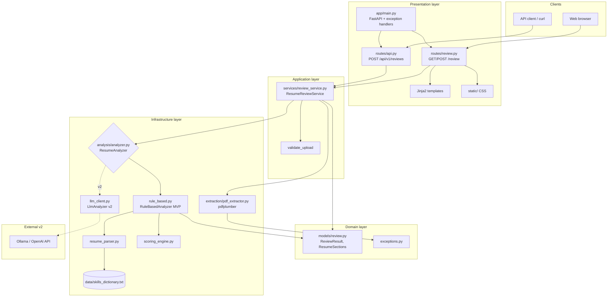
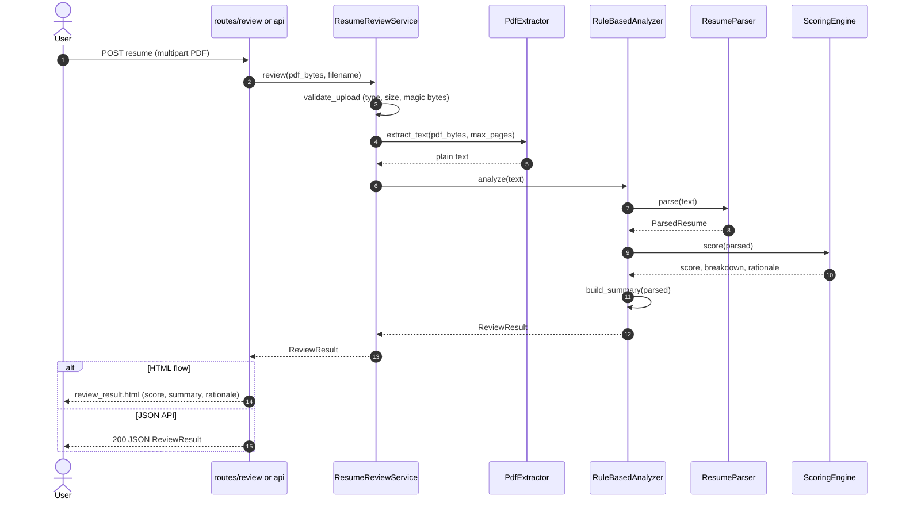
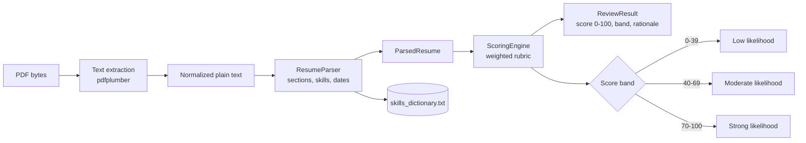
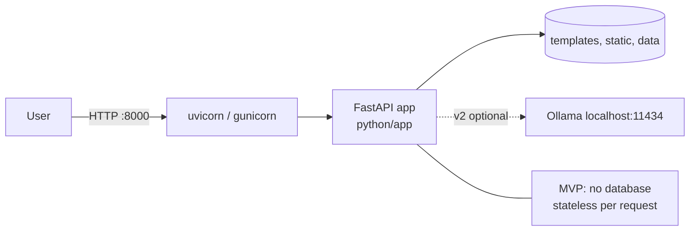

# Software Design Spec: PDF Resume Reviewer

## 1. Overview

### 1.1 Purpose

Build a web application that accepts a PDF resume, extracts its text, analyzes content, and returns:

1. A **structured summary** of the candidate (experience, skills, education, highlights).
2. A **hireability signal** — an estimate of how likely a hiring manager is to shortlist the resume, with brief rationale.

The product evolves in two phases:

| Phase | Approach | Goal |
|-------|----------|------|
| **MVP** | Rule-based + lightweight local NLP (no cloud LLM) | Ship fast, run offline, predictable cost |
| **v2** | LLM-backed analysis (local or API) | Richer summaries, role-aware scoring, natural-language feedback |

### 1.2 Source requirements

From [thoughts.md](./thoughts.md):

- Upload PDF → scan → summarize → likelihood of pickup by hiring manager.
- Start as simple as possible with a **local model**.
- Eventually move to **LLM-based** review.

### 1.3 Non-goals (MVP)

- User accounts, authentication, or multi-tenant billing.
- Persistent storage of resumes (optional in v2).
- Job-description matching against a live ATS integration.
- Guaranteed legal compliance (EEO, bias audits) — design should avoid obvious bias signals in scoring copy, but formal compliance is out of scope for MVP.

---

## 2. System context

High-level data flow (see [§4.1](#41-system-design-diagrams) for component, sequence, and deployment diagrams).



### 2.1 Technology stack (Python)

| Layer | Choice | Rationale |
|-------|--------|-----------|
| Runtime | Python 3.14+ | Current stable (3.14.5, May 2026); modern typing, wide ML/NLP ecosystem |
| Web framework | **FastAPI** | Async-ready, automatic OpenAPI, easy multipart uploads |
| Templates | **Jinja2** (via Starlette) | Simple server-rendered MVP UI |
| Validation / config | **Pydantic** + **pydantic-settings** | Typed `ReviewResult`, env-based config |
| PDF extraction | **pypdf** or **pdfplumber** | Pure Python; pdfplumber handles layout better |
| HTTP client (v2) | **httpx** | Ollama / OpenAI calls |
| Tests | **pytest** + **httpx** TestClient | Fast unit and API tests |
| Packaging | **uv** or **pip** + `pyproject.toml` | Standard modern Python project layout |

The legacy Scala/Spring app in this repository is **out of scope** for the resume reviewer. The Python app lives under `python/` with packaging via the repo-root `pyproject.toml`.

### 2.2 Run model

```bash
# Development
uvicorn app.main:app --reload --port 8000

# Production (example)
gunicorn app.main:app -k uvicorn.workers.UvicornWorker -w 2 -b 0.0.0.0:8000
```

---

## 3. Functional requirements

### 3.1 User flows

#### Flow A — Single resume review (MVP)

1. User opens `GET /review`.
2. User selects a PDF file (max size configurable, default 5 MB).
3. User submits the form (`POST /review`).
4. System validates file type and size.
5. System extracts plain text from the PDF.
6. System runs analysis pipeline (see §5).
7. System displays results page: summary sections + score (0–100) + top strengths / gaps.

#### Flow B — API review (MVP — first-class)

1. Client `POST /api/v1/reviews` with `multipart/form-data` field `resume`.
2. Response: JSON body (see §6.2).

FastAPI exposes both HTML and JSON from the same service layer.

### 3.2 Inputs

| Field | Type | Constraints |
|-------|------|-------------|
| `resume` | PDF file | Required; `application/pdf`; max 5 MB; max 10 pages (reject or truncate with warning) |

Optional (v2):

| Field | Type | Purpose |
|-------|------|---------|
| `job_title` | string | Tailor scoring weights |
| `required_skills` | list of strings | Keyword / embedding match |

### 3.3 Outputs

| Output | Description |
|--------|-------------|
| **Summary** | Name (if detected), years of experience (estimate), roles, skills, education bullets |
| **Pickup score** | Integer 0–100 with label band (e.g. Low / Moderate / Strong) |
| **Rationale** | 3–5 bullet points explaining score (MVP: template + detected signals) |
| **Extracted text preview** | First N characters for debugging (dev mode only) |

---

## 4. Architecture

### 4.1 System design diagrams

#### Component architecture



#### Review request sequence (MVP)



#### Analysis pipeline (MVP)



#### Deployment view (local / single-node)



### 4.2 Layered design

| Layer | Modules | Responsibility |
|-------|---------|----------------|
| Presentation | `main.py`, `routes/`, Jinja2, `static/` | HTTP, HTML/JSON responses, error pages |
| Application | `review_service.py` | Orchestrate validation, extraction, analysis |
| Domain | `models/review.py`, `exceptions.py` | Typed results and domain errors |
| Infrastructure | `extraction/`, `analysis/` | PDF parsing, rules, scoring; LLM in v2 |

### 4.3 Components

| Component | Responsibility |
|-----------|----------------|
| `routes/review.py` | HTTP: upload form, validation, call service, HTML or JSON response |
| `services/review_service.py` | Orchestrate extract → analyze → score; return `ReviewResult` |
| `extraction/pdf_extractor.py` | PDF bytes → UTF-8 string; handle encrypted / scanned PDFs |
| `analysis/resume_parser.py` | Section detection (Experience, Education, Skills) via headings + heuristics |
| `analysis/analyzer.py` | Protocol + `RuleBasedAnalyzer` (MVP), `LlmAnalyzer` (v2) |
| `analysis/scoring_engine.py` | Weighted rubric → 0–100 + rationale bullets |
| `models/review.py` | Pydantic models: `ReviewResult`, `ResumeSections`, `ReviewContext` |

### 4.4 Project layout (implemented)

```
resume-reviewer/                    # Python app root
├── pyproject.toml
├── requirements.txt               # or lockfile via uv
├── .env.example
├── app/
│   ├── __init__.py
│   ├── main.py                    # FastAPI app factory, mount routes
│   ├── config.py                  # Settings (pydantic-settings)
│   ├── dependencies.py            # DI: get_review_service()
│   ├── models/
│   │   └── review.py              # ReviewResult, ResumeSections, errors
│   ├── routes/
│   │   ├── review.py              # GET/POST /review (HTML)
│   │   └── api.py                 # POST /api/v1/reviews (JSON)
│   ├── services/
│   │   └── review_service.py
│   ├── extraction/
│   │   └── pdf_extractor.py
│   └── analysis/
│       ├── resume_parser.py
│       ├── scoring_engine.py
│       ├── analyzer.py            # Protocol + implementations
│       ├── rule_based.py
│       └── llm_client.py          # v2: Ollama via httpx
├── templates/
│   ├── review.html
│   └── review_result.html
├── static/
│   └── style.css
├── data/
│   └── skills_dictionary.txt      # optional seed list
└── tests/
    ├── conftest.py
    ├── fixtures/                  # sample PDFs + .txt (synthetic only)
    ├── test_pdf_extractor.py
    ├── test_resume_parser.py
    ├── test_scoring_engine.py
    └── test_api.py
```

---

## 5. Analysis pipeline (MVP)

### 5.1 Text extraction

- Library: **pdfplumber** (preferred for column/layout) or **pypdf** (lighter dependency).
- Steps: open `BytesIO` → iterate pages → `extract_text()` → normalize whitespace with `re` / `str.split`.
- **Scanned PDFs**: no OCR in MVP; raise `UnreadablePdfError` with message: *"This PDF appears to be image-only; please upload a text-based PDF."*
- **OCR** (v2): `pytesseract` + `pdf2image`, or cloud OCR behind feature flag.

```python
# extraction/pdf_extractor.py (sketch)
def extract_text(pdf_bytes: bytes, max_pages: int = 10) -> str:
    ...
```

### 5.2 Parsing heuristics

| Signal | Method |
|--------|--------|
| Sections | `re` + line-based headers: `Experience`, `Education`, `Skills`, `Summary` |
| Dates | `dateutil` or regex: `MM/YYYY`, `Jan 2020 – Present` |
| Skills | Lines under Skills section; match against `SKILL_DICT` set |
| Contact | `re` for email, phone, LinkedIn URL |
| Tenure | Sum employment date ranges (approximate) |

Optional MVP enhancement: **spaCy** `en_core_web_sm` for noun chunks — still local, no LLM. Keep optional to avoid heavy default install.

### 5.3 Scoring rubric (MVP — transparent, local)

Weighted subscores (sum = 100):

| Dimension | Weight | Signals |
|-----------|--------|---------|
| Structure & completeness | 20 | Has contact, experience, education; reasonable length (1–3 pages) |
| Experience depth | 25 | Years inferred; progression keywords (lead, senior, manager) |
| Skills relevance | 20 | Count of recognized tech/business skills from dictionary |
| Impact language | 20 | Action verbs (built, led, increased, reduced) + numeric metrics (`%`, `$`, `k`) |
| Clarity & formatting proxy | 15 | Low special-char noise; bullet-like lines; not excessive ALL CAPS |

**Pickup score** = weighted sum, clamped 0–100.

**Bands**:

| Score | Label |
|-------|-------|
| 0–39 | Low likelihood |
| 40–69 | Moderate likelihood |
| 70–100 | Strong likelihood |

Rationale bullets are generated from subscores (e.g. *"Strong use of quantified outcomes"* / *"Limited skills section detected"*).

### 5.4 Summary generation (MVP)

Template-based summary (no generative model), implemented with `str.format` or Jinja2 string template:

```
Candidate overview: ~{years} years experience; skills include {top_skills}.
Recent roles: {last_two_titles}.
Education: {education_lines}.
Highlights: {top_metrics_or_bullets}.
```

### 5.5 v2 — LLM path

- **Local**: [Ollama](https://ollama.com) HTTP API (`POST /api/generate`) with a small model (e.g. `llama3.2`, `mistral`).
- **Cloud** (optional): OpenAI-compatible API via env `LLM_API_KEY`.
- **Prompt contract**: request JSON (`summary`, `score`, `rationale`, `sections`); validate with Pydantic; **fallback** to `RuleBasedAnalyzer` on parse failure.
- **Interface**:

```python
# analysis/analyzer.py
from typing import Protocol

class ResumeAnalyzer(Protocol):
    def analyze(self, text: str, context: ReviewContext | None = None) -> ReviewResult: ...
```

- Implementations: `RuleBasedAnalyzer`, `LlmAnalyzer`; selected via `Settings.analyzer` (`"rule"` | `"llm"`).

---

## 6. API & UI

### 6.1 Web UI (MVP)

| Route | Method | Response |
|-------|--------|----------|
| `/` | GET | Redirect to `/review` |
| `/review` | GET | `review.html` — upload form |
| `/review` | POST | `review_result.html` — multipart `resume` |

Template context: `summary`, `score`, `band`, `rationale`, `sections`.

Use `Jinja2Templates(directory="templates")` and `TemplateResponse` from FastAPI/Starlette.

### 6.2 REST API (MVP)

**Request**

```http
POST /api/v1/reviews
Content-Type: multipart/form-data

resume=<pdf binary>
```

**Response** `200 OK`

```json
{
  "score": 72,
  "band": "Strong likelihood",
  "summary": "Candidate overview: ...",
  "rationale": [
    "Clear experience section with 8+ years inferred",
    "Multiple quantified achievements detected"
  ],
  "sections": {
    "skills": ["Python", "FastAPI", "AWS"],
    "education": ["B.S. Computer Science"]
  },
  "analyzed_at": "2026-05-16T12:00:00Z"
}
```

Pydantic model uses `model_config = ConfigDict(populate_by_name=True)` and `Field(alias="analyzedAt")` if camelCase clients are needed.

**Errors** (FastAPI `HTTPException` or custom exception handlers)

| Code | When |
|------|------|
| 400 | Missing file, wrong type, too large |
| 422 | Unreadable PDF, image-only PDF |
| 500 | Unexpected extraction/analysis failure |

OpenAPI docs auto-generated at `/docs` (Swagger UI).

---

## 7. Data model

MVP is **stateless** — no database required.

Pydantic models (sketch):

```python
class ResumeSections(BaseModel):
    skills: list[str] = []
    education: list[str] = []
    experience_titles: list[str] = []

class ReviewResult(BaseModel):
    score: int = Field(ge=0, le=100)
    band: str
    summary: str
    rationale: list[str]
    sections: ResumeSections
    analyzed_at: datetime
```

Optional v2 persistence (SQLAlchemy + SQLite/Postgres):

| Table `reviews` | Columns |
|-----------------|---------|
| | `id`, `uploaded_at`, `score`, `summary_json`, `file_hash` |

Store hash only, not raw PDF, unless explicitly required.

---

## 8. Dependencies

`pyproject.toml` / `requirements.txt` (MVP):

```toml
[project]
name = "resume-reviewer"
requires-python = ">=3.14"
dependencies = [
    "fastapi>=0.110",
    "uvicorn[standard]>=0.27",
    "python-multipart>=0.0.9",   # file uploads
    "jinja2>=3.1",
    "pydantic>=2.6",
    "pydantic-settings>=2.2",
    "pdfplumber>=0.11",          # or pypdf>=4.0
]

[project.optional-dependencies]
dev = ["pytest>=8.0", "httpx>=0.27", "pytest-cov>=4.1"]
llm = ["httpx>=0.27"]
nlp = ["spacy>=3.7"]             # optional; document model download
```

v2:

```text
httpx          # Ollama / OpenAI
```

---

## 9. Configuration

`.env` / environment variables (via `pydantic-settings`):

| Variable | Default | Description |
|----------|---------|-------------|
| `RESUME_MAX_FILE_SIZE_BYTES` | `5242880` | 5 MB |
| `RESUME_MAX_PAGES` | `10` | Reject over limit |
| `ANALYZER` | `rule` | `rule` \| `llm` |
| `LLM_BASE_URL` | `http://localhost:11434` | Ollama endpoint |
| `LLM_MODEL` | `llama3.2` | Model name |
| `SHOW_EXTRACTED_TEXT` | `false` | Debug preview in HTML |

```python
# app/config.py
from pydantic_settings import BaseSettings, SettingsConfigDict

class Settings(BaseSettings):
    model_config = SettingsConfigDict(env_file=".env")
    resume_max_file_size_bytes: int = 5_242_880
    resume_max_pages: int = 10
    analyzer: str = "rule"
    llm_base_url: str = "http://localhost:11434"
    llm_model: str = "llama3.2"
    show_extracted_text: bool = False
```

---

## 10. Security & privacy

- Validate PDF magic bytes (`%PDF`), not only `Content-Type` or filename.
- Read uploads into `bytes` or `SpooledTemporaryFile`; **delete** temp files in `finally`.
- Do not log full resume text in production (`logging` filters).
- Rate-limit uploads per IP (v2): `slowapi` or reverse proxy.
- Disclaimer on UI: automated estimate only; not a hiring decision.

---

## 11. Error handling

Custom exceptions mapped in `app/main.py`:

| Exception | HTTP | User message |
|-----------|------|--------------|
| `EmptyUploadError` | 400 | "Please select a PDF file." |
| `InvalidFileTypeError` | 400 | "Only PDF files are supported." |
| `FileTooLargeError` | 400 | "File exceeds maximum size." |
| `EncryptedPdfError` | 422 | "Cannot read password-protected PDFs." |
| `UnreadablePdfError` | 422 | "Upload a text-based PDF or enable OCR (coming soon)." |
| bare `Exception` | 500 | Generic message; log traceback server-side |

Parser finds no sections → still return score with low structure subscore.

---

## 12. Testing strategy

| Layer | Tooling |
|-------|---------|
| `pdf_extractor` | pytest; fixtures: 1-page, multi-page, malformed PDFs under `tests/fixtures/` |
| `resume_parser` | parametrize plain-text strings |
| `scoring_engine` | table-driven: input → expected score range |
| `review_service` | integration with fixture PDF on disk |
| API | `httpx.AsyncClient` + `ASGITransport(app=app)` or FastAPI `TestClient` |

```bash
pytest tests/ -v --cov=app
```

Sample resumes: **synthetic fixtures only** (no real PII in repo).

---

## 13. Implementation plan

### Phase 0 — Scaffold (1 day)

- [ ] `pyproject.toml`, `app/main.py`, `Settings`, health route `GET /health`
- [ ] `pdf_extractor` + custom exceptions
- [ ] Jinja2 templates stub

### Phase 1 — MVP rule engine (3–4 days)

- [ ] `resume_parser` + skill dictionary
- [ ] `scoring_engine` + `RuleBasedAnalyzer`
- [ ] `ReviewService`, HTML `/review` + JSON `/api/v1/reviews`
- [ ] pytest coverage for core modules

### Phase 2 — Polish (1–2 days)

- [ ] `.env.example`, README (install, run, test)
- [ ] Static CSS, error pages
- [ ] Optional: Docker `Dockerfile` for single-container deploy

### Phase 3 — LLM (future)

- [ ] `LlmAnalyzer` + Ollama via httpx
- [ ] Pydantic JSON validation + fallback to rules
- [ ] `job_title` / `required_skills` on API
- [ ] Expand OpenAPI examples

---

## 14. Open questions

1. **Audience**: hiring managers only, or candidates self-checking resumes? (Affects tone of rationale copy.)
2. **Role awareness**: Should MVP scoring use a fixed skill dictionary, or user-provided job description text?
3. **Repo layout**: New `python/` directory in this repo vs. separate repository — and whether to remove legacy Scala code.
4. **UI**: Server-rendered Jinja2 only, or add a React/Vue SPA later consuming the JSON API?
5. **Deployment**: Local-only (`uvicorn --reload`) vs. Docker/cloud with auth?

---

## 15. Success criteria

| Criterion | Target |
|-----------|--------|
| End-to-end upload → result | < 5 s for 2-page text PDF on laptop |
| Deterministic MVP scores | Same PDF → same score (no network) |
| Readable summary | Non-empty skills + experience line for typical tech resume |
| Operable offline | No external API calls when `ANALYZER=rule` |
| Developer experience | `uvicorn` + `pytest` documented in README |

---

## Appendix A — Example result (MVP mock)

**Pickup score:** 68 — *Moderate likelihood*

**Summary:** Candidate overview: ~6 years experience; skills include Python, FastAPI, AWS. Recent roles: Software Engineer, Senior Developer. Education: B.S. Computer Science.

**Rationale:**

- Experience section detected with multiple date ranges
- Several action verbs and one quantified metric found
- Skills section present but could list more relevant keywords
- Resume length within expected range

---

## Appendix B — FastAPI route sketch

```python
# app/routes/api.py
from fastapi import APIRouter, File, UploadFile, Depends

router = APIRouter(prefix="/api/v1")

@router.post("/reviews", response_model=ReviewResult)
async def create_review(
    resume: UploadFile = File(...),
    service: ResumeReviewService = Depends(get_review_service),
) -> ReviewResult:
    pdf_bytes = await resume.read()
    return service.review(pdf_bytes, filename=resume.filename)
```

```python
# app/services/review_service.py
class ResumeReviewService:
    def __init__(self, extractor: PdfExtractor, analyzer: ResumeAnalyzer, settings: Settings):
        self._extractor = extractor
        self._analyzer = analyzer
        self._settings = settings

    def review(self, pdf_bytes: bytes, filename: str | None = None) -> ReviewResult:
        validate_upload(pdf_bytes, filename, self._settings)
        text = self._extractor.extract_text(pdf_bytes, max_pages=self._settings.resume_max_pages)
        return self._analyzer.analyze(text)
```
